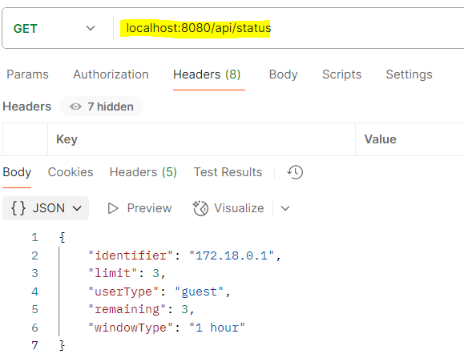
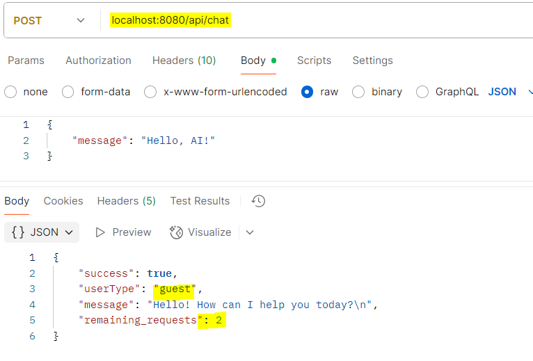
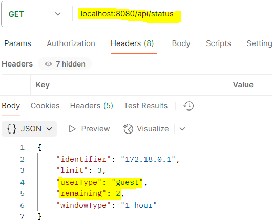
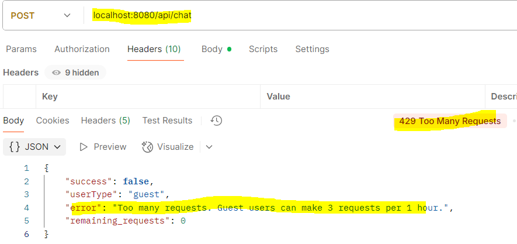
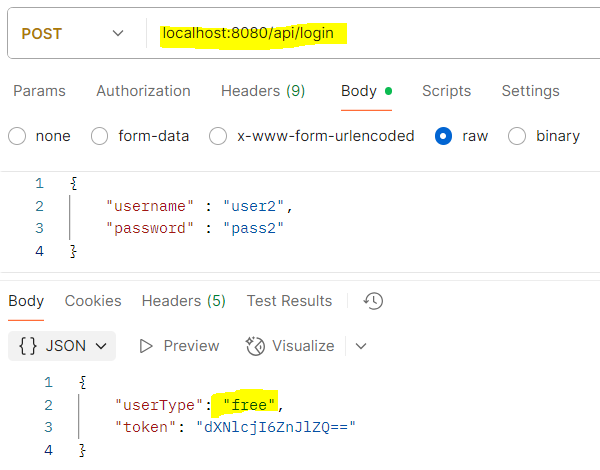
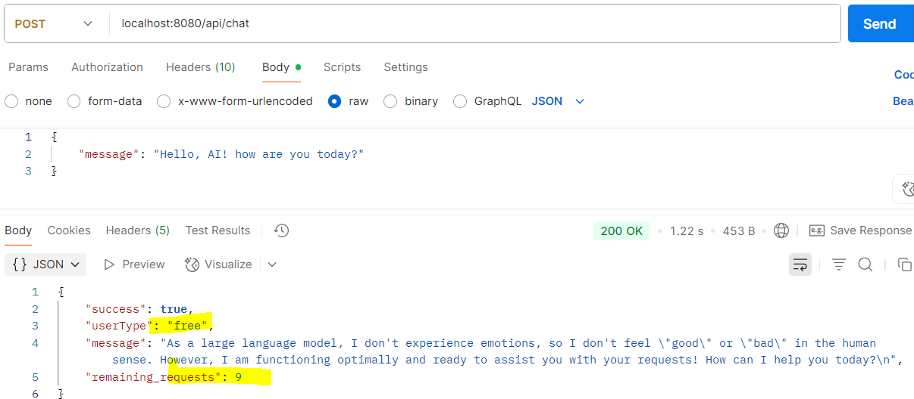
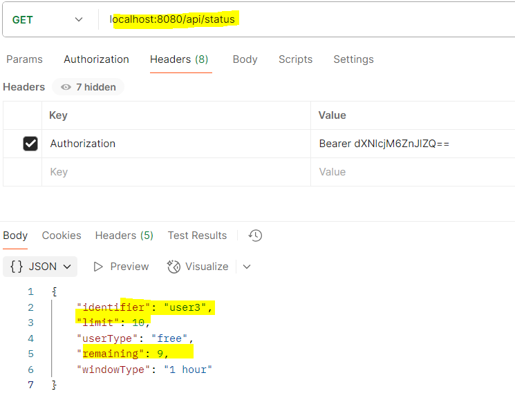
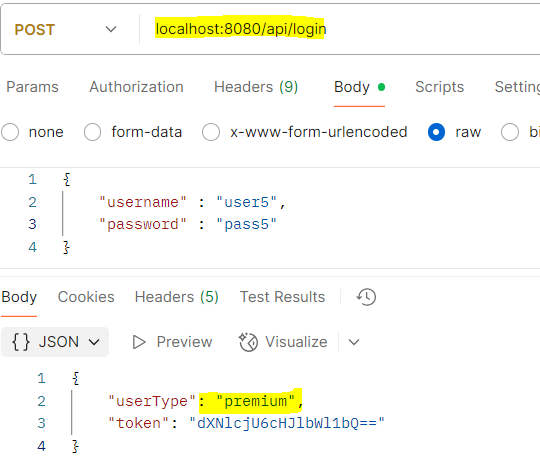
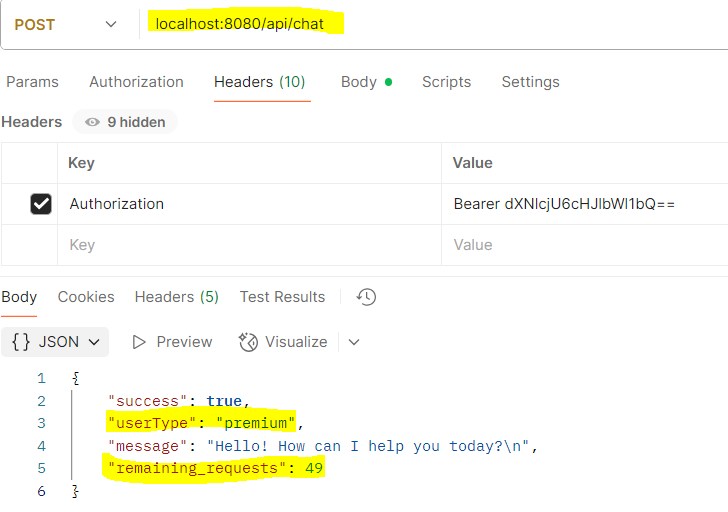
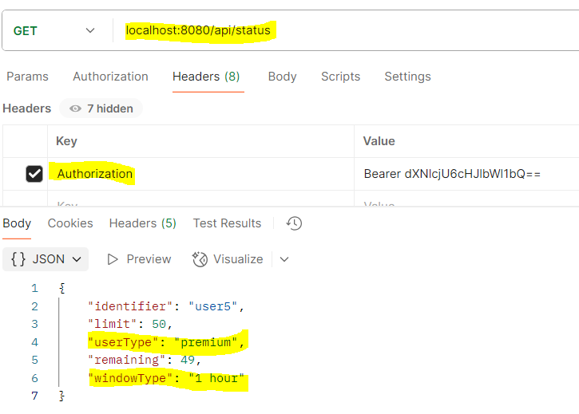

# AI Chatbot with Rate Limiting

This project is an AI-powered chatbot API with strict rate limiting per user type, built for cost control and fair usage. It uses the Gemini API for AI responses and supports running in Docker with Redis and PostgreSQL for persistence and distributed rate limiting.

## Features
- **AI Chatbot**: Integrates with Gemini API for AI-powered responses.
- **Rate Limiting**: Fixed window rate limiting per hour:
  - Guest: 3 requests/hour (by IP)
  - Free: 10 requests/hour (login required)
  - Premium: 50 requests/hour (login required)
- **Endpoints**:
  - `POST /api/chat` – Send a message to the AI (rate limited)
  - `POST /api/login` – Get a user token
  - `GET /api/status` – Check remaining requests for the current user
- **Dockerized**: Runs with `docker compose up` (includes Redis and Postgres)
- **Tech Stack**: Java 17, Spring Boot, Redis, PostgreSQL, Docker

## How to Run (Docker Only)

1. **Build the JAR:**
   ```
   ./gradlew clean bootJar
   ```
2. **Start all services:**
   ```
   docker compose up -d
   ```
3. **Check status:**
   ```
   curl http://localhost:8080/api/status
   ```

## API Endpoints

| Endpoint           | Method | Auth Required | Description                        |
|-------------------|--------|--------------|------------------------------------|
| /api/login        | POST   | No           | Login and get user token           |
| /api/chat         | POST   | Yes (for free/premium) | Send message to AI (rate limited) |
| /api/status       | GET    | Optional     | Check remaining requests           |

## Example Requests & Responses

### 1. POST /api/login
**Request Body:**
```json
{ "username": "user1", "password": "pass1" }
```
**Response:**
```json
{ "token": "...", "userType": "free" }
```

### 2. POST /api/chat
**Request Body:**
```json
{ "message": "Hello AI!" }
```
**Success Response:**
```json
{ "success": true, "message": "AI response here...", "userType": "free", "remaining_requests": 9 }
```
**Rate Limit Response:**
```json
{ "success": false, "error": "Too many requests. Free users can make 10 requests per hour.", "userType": "free", "remaining_requests": 0 }
```

### 3. GET /api/status
**Without Token (Guest):**
```json
{
  "identifier": "127.0.0.1",
  "userType": "guest",
  "limit": 3,
  "remaining": 3,
  "windowType": "1 hour"
}
```
**With Token (Free User):**
```json
{
  "identifier": "user1",
  "userType": "free",
  "limit": 10,
  "remaining": 8,
  "windowType": "1 hour"
}
```
**With Token (Premium User):**
```json
{
  "identifier": "user2",
  "userType": "premium",
  "limit": 50,
  "remaining": 49,
  "windowType": "1 hour"
}
```

## User Table (Default Users)
| Username | Password | User Type |
|----------|----------|-----------|
| user1    | pass1    | free      |
| user2    | pass2    | free      |
| user3    | pass3    | free      |
| user4    | pass4    | premium   |
| user5    | pass5    | premium   |

> These users are created automatically in the database on first run (see `DatabaseInitConfig.java`).

## Screenshots

Below are example screenshots for different user flows. Replace these with your actual screenshots as needed.

- **Guest User - Initial Status Check:**
  
  
  
- **Guest User - Chat Attempt (Rate Limit):**
  
  
  
- **Guest User - Status After Limit:**
  
  
  
- **Guest User - Status After Rate Limit exceed:**
  
  

- **Free User - Login:**
  
  
  
- **Free User - Chat Attempt (Rate Limit):**
  
  
  
- **Free User - Status After Limit:**
  
  

- **Premium User - Login:**
  
  
  
- **Premium User - hat Attempt (Rate Limit):**
  
  
  
- **Premium User - Status Check:**
  
  


## Tech Stack
- Java 17
- Spring Boot
- Redis (rate limiting)
- PostgreSQL (user storage)
- Docker & Docker Compose
- Gemini API (AI responses)

## How It Works
- **Rate Limiting**: Each user/IP gets a Redis key per window. Requests increment the count. If the limit is reached, further requests are blocked until the window resets.
- **User Types**: Guests are tracked by IP. Free/Premium users must login and use their token.
- **AI Integration**: Calls Gemini API for chat responses, but only if under the rate limit.

## Notes
- All rate limiting is enforced before calling the AI API to save costs.
- The project is ready for production and can be scaled horizontally (rate limiting is distributed via Redis).

---

For any issues, please check the logs with `docker compose logs ai-chatbot` or open an issue.
